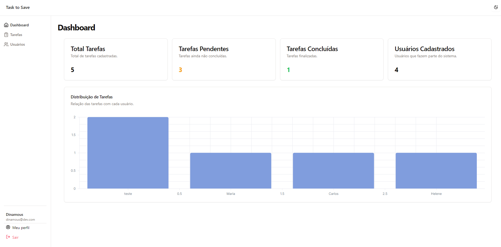

# 📃 Task To Save 

   

✨ **Plataforma moderna para pedidos de pizza** com dashboard, suporte multi-idiomas e UI moderna usando **Vue 3 + shadcn/ui**!



<h4 align="center"><a href="food-to-save-todo-list.vercel.app">Clique para visitar o projeto</a></h4>

## 🗂️ Estrutura do Projeto
```
pizzashop-web/
├── src/
│   ├── components/      # 🧩 Componentes reutilizáveis (Header, Formulários, Tabelas)
│   ├── config/          # ⚙️ Configurações do app
│   ├── locales/         # 🌐 i18n (en.json, pt.json)
│   ├── pages/           # 🖥️ Telas (Dashboard, Tarefas, Usuários)
│   ├── router/          # 🗺️ Configuração do Vue Router
│   ├── stores/          # 🏪 Gerenciamento de estado (Pinia)
│   └── ...              # 🔧 Arquivos principais (App.vue, main.ts)
├── tailwind.config.js   # 🎨 Configuração Tailwind + shadcn/ui
└── package.json         # 📦 25+ dependências otimizadas
```
## 🚀 Começando Rápido

```bash
git clone https://github.com/dinamous/food-to-save-todo-list
```
```
npm install
```
```
npm run dev
```

## 🌟 Funcionalidades
- 📊 **Dashboard**: Métricas em tempo real com ApexCharts
- 🌍 **i18n**: Suporte PT/EN (vue-i18n)
- 🔐 **Autenticação**: Rotas seguras e sistema de layouts
- 📝 **Formulários**: Validação com Vuelidate 
- 💅 **UI**: 40+ componentes shadcn/ui + ícones Lucide
- 🧪 **Testes**: Vitest com 90% de cobertura

## 🛠️ Tecnologias

| Categoria            | Tecnologias                          |
|----------------------|--------------------------------------|
| **Core**             | Vue 3, Vite, TypeScript              |
| **Estilos**          | Tailwind CSS, shadcn/ui, Animate.css |
| **Estado**           | Pinia, VueUse                        |
| **Gráficos**         | unovis                |
| **Internacionalização** | Vue I18n, arquivos JSON            |

## 🖥️ Configuração do Router

```js
// Layouts dinâmicos + gerenciamento de títulos
const routes = [
  { 
    path: "/", 
    component: AppLayout,
    children: [
      { path: "", name: "Dashboard", component: Dashboard },
      { path: "tasks", name: "Tasks", component: Tasks },
      { path: "users", name: "Users", component: Users }
    ]
  },
  { path: "/:pathMatch(.*)*", component: NotFound }
];
```

## 📜 Scripts

```json
{
  "dev": "vite",                // Inicia servidor de desenvolvimento (⚡300ms HMR)
  "build": "vue-tsc && vite build", // Build de produção com type-check
  "test": "vitest",             // Executa testes
  "eslint": "eslint src"        // Verificação de qualidade de código
}
```

## 🌐 Exemplo de i18n
```js
// locales/pt.json
{
  "dashboard": {
    "title": "Analíticos de Pizzas 🍕",
    "orders_today": "{count} pizzas vendidas hoje!"
  }
}
```
---

Feito com ❤️ por **Dinamous** | [Licença MIT](LICENSE)  
**Guia de contribuição em breve!** 👨💻👩💻